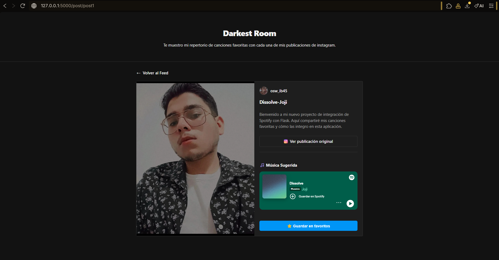
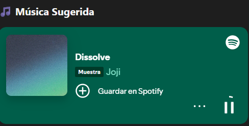
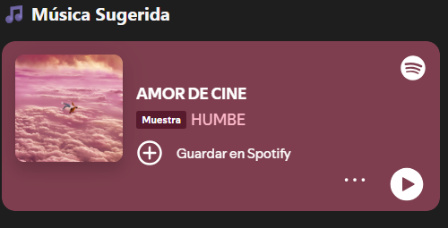
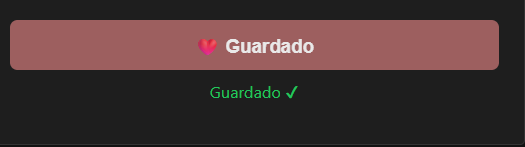
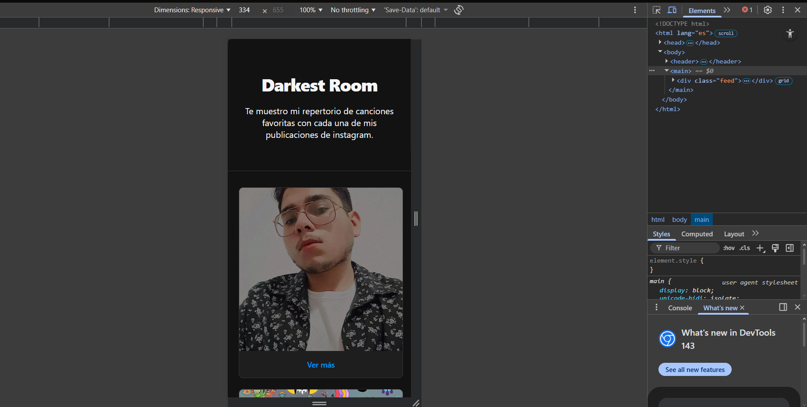
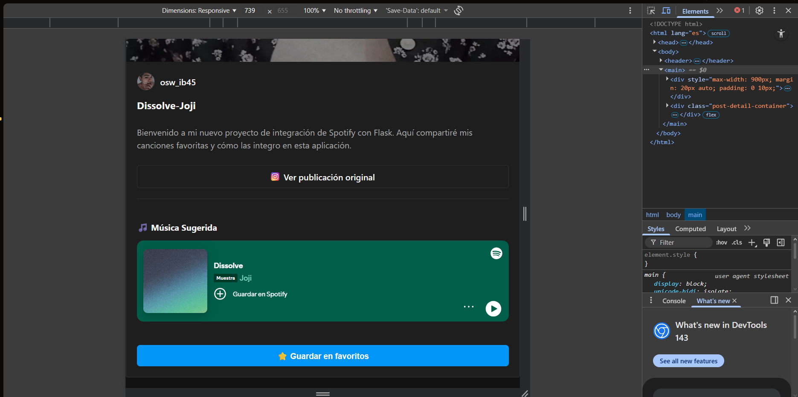

# CreacionAppAPIs
Aplicación web desarrollada con APIs de streaming (spotify), redes sociales (simulación de Meta Graphics) y bases de datos (superbase). La aplicación simula un blog donde se comparten post de instagram. El usuario puede contribuir dando me gusta, la publicación y la canción se almacenarán en una base de datos en Superbase.


## Estructura del proyecto.

```text
social_flask_app_ver2/
├── .vscode/                # Configuraciones locales del editor
├── services/               # Lógica de APIs y servicios
│   ├── __pycache__/        # Archivos temporales de Python (ignorados por git)
│   ├── database_api.py     # Integración con Supabase
│   ├── social_api.py       # Simulación de datos de Instagram
│   └── streaming_api.py    # Integración con Spotify (Spotipy)
├── static/                 # Archivos estáticos
│   ├── Actividad 6_Pantallas/
│   ├── css/
│   │   └── styles.css      # Estilos globales y diseño responsivo
│   └── img/                # Imágenes de los posts (img1.jpg, etc.)
├── templates/              # Plantillas HTML (Jinja2)
│   ├── base.html           # Estructura principal y header
│   ├── index.html          # Feed principal de publicaciones
│   └── post.html           # Detalle del post y reproductores de música
├── .cache/                 # Caché de autenticación de Spotify
├── .gitignore              # Archivos excluidos de la subida a GitHub
├── app.py                  # Archivo principal de Flask (rutas)
├── README.md               # Documentación del proyecto
└── requirements.txt        # Librerías necesarias (flask, requests, spotipy)
```

## El cerebro de la aplicación: **app.py**
1. Importaciones y Configuración Inicial
Framework: Se importa **Flask** para crear la app y herramientas como **render_template** (para mostrar HTML) y **request**/**redirect** para manejar datos del usuario.
Servicios Externos: Importas funciones de **social_api.py** para obtener los posts y de **database_api.py** para guardar favoritos en Supabase.
Instancia: **app = Flask(__name__)** crea el objeto principal que correrá tu servidor web.

2. Definición de Rutas (Endpoints)
**GET** / (Ruta de Inicio)
Es la puerta de entrada. Llama a **get_posts()** para traer la lista de publicaciones desde tu "base de datos" simulada en el servicio social y se las pasa al archivo index.html.

**GET /post/<post_id>** (Detalle de Publicación)

Esta ruta es dinámica (el **<post_id>** cambia según el post que selecciones).
Búsqueda: Usa el ID de la URL para buscar el post específico con **get_post(post_id)**.
Seguridad: Si el ID no existe, devuelve un error 404 "Post no encontrado".
Lógica del Iframe: Aquí es donde ocurre la magia que configuramos antes: la función solo envía el objeto post completo. Como ya configuraste los **if/else** en el HTML, el navegador sabe qué iframe estático de Spotify mostrar sin que Python tenga que procesar enlaces complejos.

**POST /favorite/<post_id>** (Acción de Favoritos)
Esta ruta no devuelve una página nueva, sino que procesa datos enviados desde un formulario.

**Captura de datos**: Obtiene el **title** y el **track_id** que vienen ocultos en el formulario del post.
Transformación de ID: Hace una limpieza interesante: **int(post_id.replace("post", ""))**. Si el ID era "post1", lo convierte en el número **1** para que Supabase lo guarde como un entero.
Persistencia: Llama a **save_to_favorites** para mandar esos datos a tu base de datos en la nube.
Respuesta: Devuelve un código **200** (Éxito) sin recargar la página necesariamente (o vacío).

3. Ejecución del Servidor
```
if __name__ == "__main__":
    app.run(debug=True)
```
**Modo Debug**: Al estar en **True**, el servidor se reinicia automáticamente cada vez que guardas un cambio en el código y te muestra errores detallados si algo falla, lo cual es ideal para desarrollo.
##Vista de la aplicación.

## Consumo de las APIs

### social_api.py
Debido a las restricciones de acceso a la API real de Instagram, este módulo actúa como un mock service (servicio de simulación) que provee la información necesaria para alimentar el feed de la aplicación.

Funcionalidades principales:
**Simulación de Datos**: Centraliza una lista de diccionarios que contienen metadatos de publicaciones, incluyendo títulos, descripciones, rutas de imágenes locales, enlaces originales y el **track_id** de Spotify vinculado.
**get_posts()**: Función que retorna el conjunto completo de publicaciones para generar el feed principal en el index.
**get_post(post_id)**: Implementa una lógica de búsqueda para filtrar y retornar una publicación específica basada en su identificador único.

Atributos de cada post:
```
| Atributo | Descripción |
| :--- | :--- |
| id | Identificador único de la publicación. |
| media_url | Ruta local a la imagen del post (/static/img/). |
| permalink | Enlace directo a la publicación original en Instagram. |
| track_id | Código alfanumérico de Spotify para el reproductor embebido. |
```
### database_api.py
Este módulo se encarga de la persistencia de datos conectando la aplicación con una instancia de Supabase (PostgreSQL) mediante su API REST. Permite que las interacciones del usuario (favoritos) se almacenen de forma permanente en la nube.

Componentes principales:
**Conexión Segura**: Utiliza **SUPABASE_URL** y **SUPABASE_KEY** para autenticar las peticiones mediante cabeceras HTTP (**Authorization** y **apikey**).
**save_to_favorites(post_id, title, track_id)**: Función que ejecuta una petición POST para insertar un nuevo registro en la tabla **favorites**.
**Manejo de Datos**: Envía un objeto JSON (payload) que vincula el ID del post, el título de la canción y su identificador de Spotify.
**Confirmación**: Valida el éxito de la operación verificando los códigos de estado HTTP **200** o **201**.

### streaming_api.py
Este servicio gestiona la comunicación con la **Spotify Web API** utilizando la librería spotipy. Su función principal es validar y buscar contenido musical para asegurar que cada post esté vinculado a un recurso real de la plataforma de streaming.

Características principales:
**Autenticación**: Utiliza el flujo **SpotifyClientCredentials** con el **CLIENT_ID** y **CLIENT_SECRET** obtenidos desde el Dashboard de Spotify for Developers para realizar peticiones autorizadas de solo lectura.
**get_spotify_track(query)**: Implementa una función de búsqueda que recibe un término (como el nombre de una canción o artista) y consulta el catálogo de Spotify.
**Manejo de Resultados**: Filtra los resultados para obtener únicamente el primer track coincidente (**limit=1**) y retorna su **Spotify ID** único.
**Robustez**: Incluye una validación para retornar **None** en caso de que la búsqueda no arroje resultados, evitando errores de ejecución en la aplicación principal.

## Aplicación en html
### base.html
Este archivo actúa como el esqueleto principal de la aplicación, utilizando el motor de plantillas Jinja2 para mantener la consistencia visual en todas las páginas y centralizar la lógica interactiva.

Componentes clave:
**Estructura Maestra**: Define el **head** con metadatos esenciales, la vinculación a los estilos CSS y la etiqueta de viewport para asegurar que el diseño sea responsivo.
**Bloques Dinámicos**: Utiliza **** para permitir que otras páginas (**index.html** y **post.html**) hereden el diseño base e inyecten su contenido específico.
**Header Unificado**: Contiene la identidad visual del proyecto ("Darkest Room"), asegurando que el título y la descripción aparezcan en todas las secciones.

Interactividad con JavaScript (Favoritos):
El archivo incluye un script especializado que mejora la experiencia de usuario (UX) al guardar canciones:
**Peticiones Asíncronas**: Utiliza la API **fetch** para enviar los datos a Supabase en segundo plano, evitando que la página se recargue por completo al dar "Me gusta".
**Retroalimentación en Tiempo Real**: Al recibir una respuesta exitosa del servidor, el botón cambia dinámicamente su texto a "❤️ Guardado" y muestra un mensaje de confirmación ("Guardado ✔"), desactivando el botón para evitar duplicados.
**Gestión de Datos**: Extrae de forma automática el ID del post, el título y el ID de la pista desde los atributos **data** del formulario.

### index.html
Este archivo es el responsable de renderizar la página de inicio, transformando los datos crudos del servicio social en una interfaz visual atractiva y organizada.

Características principales:
**Herencia de Plantilla**: Utiliza la instrucción **** para adoptar el diseño global y los scripts de favoritos definidos en la base, inyectando su contenido específico en el bloque correspondiente.
**Renderizado Dinámico**: Implementa un bucle **** de Jinja2 que recorre la lista de publicaciones enviada por Flask, generando automáticamente una tarjeta para cada post.
**Estructura de Tarjetas (.card)**: Cada publicación se encapsula en un contenedor que incluye:
  **Imagen del Post**: Muestra la fotografía mediante **{{ post.media_url }}**.
  Enlace de Detalle: Utiliza url_for para generar rutas dinámicas hacia post_detail,         permitiendo al usuario navegar hacia la vista expandida de cada publicación mediante el    botón "Ver más".
**Diseño Responsivo**: Se apoya en la clase CSS **.feed**, la cual utiliza **CSS Grid** para organizar las tarjetas de forma flexible, adaptando el número de columnas según el tamaño de la pantalla del dispositivo.

### post.html
Este archivo representa la vista detallada de cada publicación. Su función es integrar la simulación de redes sociales con el reproductor interactivo de Spotify, proporcionando una experiencia inmersiva al usuario.

Componentes clave del diseño:
**Contenedor Responsivo**: Implementa un diseño de dos columnas (imagen e información) que utiliza **Media Queries** para adaptarse a dispositivos móviles, pasando a una disposición vertical en pantallas pequeñas.
**Visualización de Contenido**:
  **Multimedia**: Renderiza la imagen principal del post a pantalla completa en su sección     asignada.
  **Metadatos**: Muestra dinámicamente la foto de perfil, el nombre de usuario                (**osw_ib45**), el título de la canción y el cuerpo del post.
  **Enlace Externo**: Incluye un botón estilizado que redirige mediante el **permalink** a     la publicación oficial en Instagram.

**Integración de Streaming (Spotify)**:
**Reproductor Embebido**: Utiliza un **<iframe>** configurado para cargar el reproductor de Spotify de forma dinámica usando el track_id del post.
**Optimización Visual**: Se configuró con una altura de **152px** para mantener un diseño horizontal "Compact", integrándose estéticamente con el flujo de la información lateral.

**Sistema de Favoritos (AJAX)**:
**Atributos de Datos**: El formulario utiliza atributos **data-*** (**data-post-id**, **data-track-id, data-title**) para almacenar la información de forma invisible en el HTML.
**Interacción Sin Recarga**: En lugar de un envío de formulario tradicional, estos datos son extraídos por el script de **base.html** para realizar una petición asíncrona a la API de favoritos, permitiendo que el usuario guarde la canción sin abandonar la página.

## Vista de la app.
### Pantalla principal.

### Consumo de las api.
**APIs DE RED SOCIAL**

**APIs DE STREAMING**



**APIs DE BASES DE DATOS**


###Diseño responsivo
**VISTA MÓVIL**




